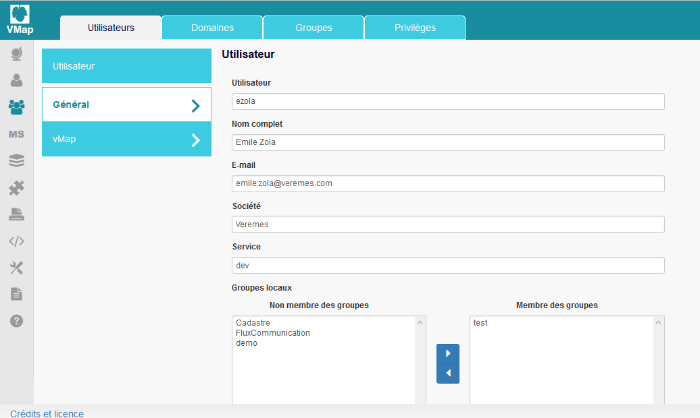
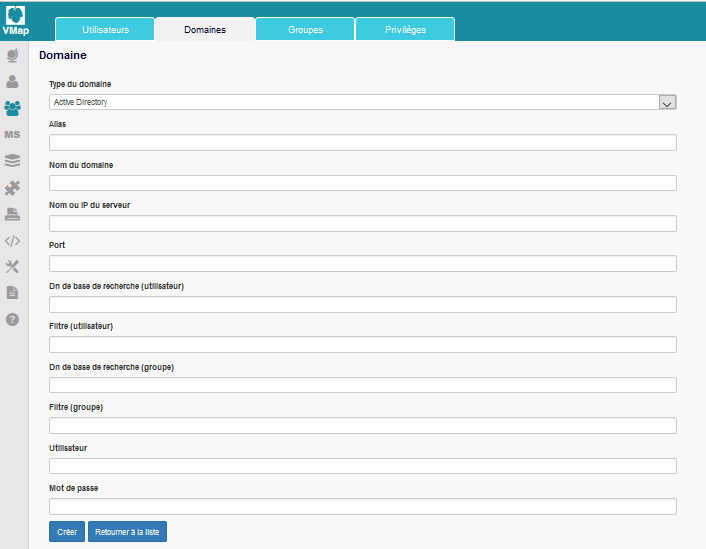

Gestion des utilisateurs 
#########################

Un utilisateur vMap est un compte connu par l’application vMap qui peut se connecter et utiliser ses services. 

Deux profils d’utilisateurs sont à distinguer :

 * Utilisateurs PostgreSQL : utilisateurs authentifiés par la base de données interne à vmap, PostgreSQL, créés directement dans vMap. 
 
 * Utilisateurs Active Directory (AD) : utilisateurs d’un domaine et authentifiés par un annuaire Active Directory, importés dans vMap.
 
 
 
 
 
1. Création d'utilisateurs et de groupes PostgreSQL
************************************************************

Le mode ‘Utilisateurs > Onglet Utilisateurs’ liste l’ensemble des utilisateurs. Il permet l’ajout de nouveaux utilisateurs, leur édition et suppression. Après avoir cliqué sur ‘Ajouter un utilisateur’, le formulaire suivant s’affiche :

2. Création d'utilisateurs et de groupes d'un annuaire Active Directory
***********************************************************************

Il est possible de gérer plusieurs domaines et d’exploiter des groupes de sécurité définis directement dans un annuaire Active Directory. 
 
L’administrateur a la possibilité d’importer des utilisateurs et des groupes depuis Active Directory. Cette méthode permet d’hériter des droits issus de la gestion centralisée AD des utilisateurs au sein d’un organisme. 
 
L’administrateur crée  le nouveau domaine, puis importe les utilisateurs et les groupes. L’attribution des groupes ainsi que les mots de passe des utilisateurs ne pourront pas être changés.

2.1 Ajout de domaines Active Directory
----------------------------------------

Le mode ‘Utilisateurs> Onglet Domaines’ liste les domaines Active Directory. Il permet de créer, modifier et supprimer des domaines. Le bouton ‘Ajouter un Domaine’ affiche le formulaire suivant. 

 
 
 
 
 L’administrateur saisit les informations suivantes : 
 
* Type, Nom et Alias du domaine : le nom de domaine utilisé pour la connexion. Par exemple,  ‘siege.entreprise.com’.
* IP ou nom de serveur : adresse IP ou nom du serveur assurant le rôle de serveur Active Directory.
* Dn de base de recherche (utilisateur) : point d’entrée pour la recherche des utilisateurs.
* Dn de base de recherche (groupe) : point d’entrée pour la recherche des groupes.
* Filtre (utilisateur) : permet de définir des filtres pour la recherche des utilisateurs.
* Filtre (groupe) : permet de définir des filtres pour la recherche des groupes.
* Vérifier les droits lors du lancement du robot : permet au robot de vérifier si un utilisateur du domaine possède toujours les droits lors de l’exécution du traitement. Pour cela le robot a besoin de connaître le login et le mot de passe d’un utilisateur du domaine.
* Login : login d’un utilisateur du domaine.
* Mot de passe : mot de passe de l’utilisateur du domaine.
 
Le login et le mot de passe saisis ici permettent de vérifier les droits de l’utilisateur Active Directory lors de l’exécution du robot. 
 
En cliquant sur « Créer » la procédure de création de domaine Active Directory est finalisée. 
 

 

