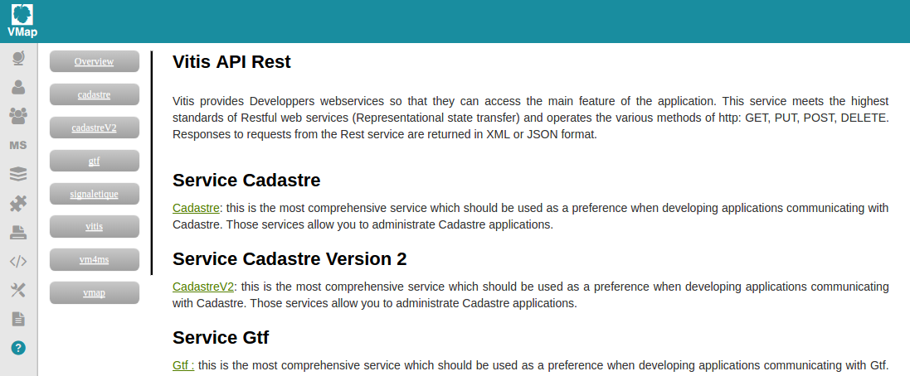

Mode visualisation cartographique
============

1. Définition
-------------

Les web services sont la partie back-end de l'application, ils se
composent de plusieurs ressources qui permettent au client d'interroger
la base de données, de lire/modifier des fichiers et d'effectuer des
opérations sur la machine physique du serveur.
