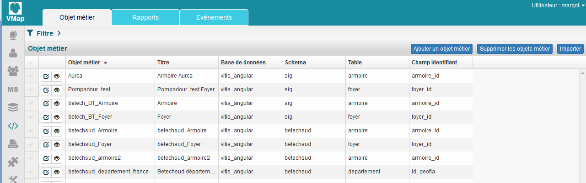
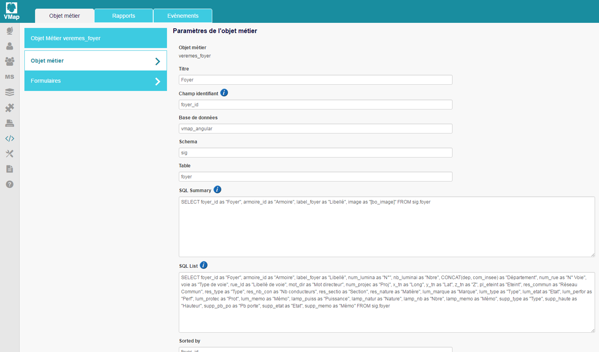
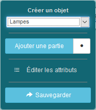

*************
Gestion des objets métiers
************* 

 
   
1. Définition
***************** 
Un objet métier est une entié qui associe à un calque, les attributs d'une table de base de données. De la sorte, les attributs associés au calque sont affichables et éditables, dans le requêteur et dans le formulaire de création d'objet,  accessibles dans le mode Carte. 

Le mode Développement permet l'ajout, l'édition et la suppression d'objets métier. 

2. Création d'un objet métier
******************************************** 
La création d'un objet métier s'opère en deux temps : 

1.  La déclaration de l'objet et des paramètres d'affichage du requêteur.
2.  La construction des formulaires d'affichage, de création, d'édition et de recherche de l'objet métier via le studio. 

2.1. Déclaration d'un objet métier 
+++++++++++++++++++++++++++++

Renseigner les champs suivants : 

* Titre: nom de l'objet métier tel qu'il apparaîtra dans le requêteur et dans le formulaire de création d'objet : 

   

2.2. Construction des formulaires d'un objet métier 
++++++++++++++++++++++++++++++++++++++++++++

 4 formulaires sont paramétrables : 
 
 1. Formulaire d'affichage de l'objet métier 
 2. Formulaire de recherche de l'objet métier 
 3. Formulaire de mise à jour de l'objet métier 
 4. Formulaire de création de l'objet métier 
 

