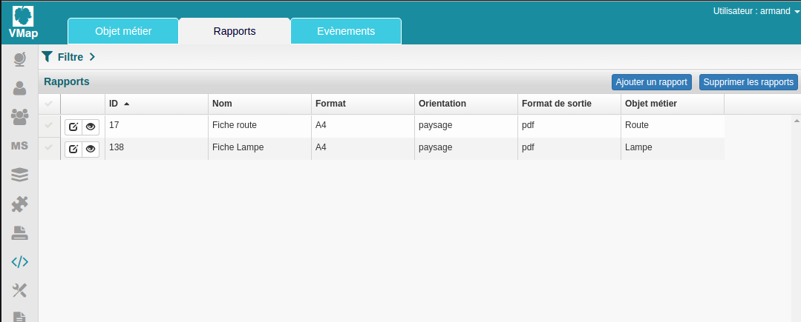
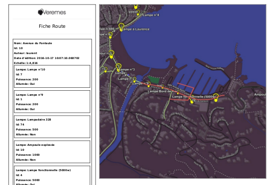

# Rapports objets métiers

## 1. Définition
Un rapport sur objet métier permettra à l'utilisateur de générer des fichiers .pdf ou .doc sur des informations d'un objet sélectionné dans le panier.
Il y a différents types de rapports: 

 - Les rapports sur un élément 
 - Les rapports sur plusieurs éléments 

Si un utilisateur sélectionne plusieurs entités et lance un rapport sur un élément, alors plusieurs fichiers seront générés, à contrario si il lance un rapport sur plusieurs éléments, un seul fichier contenant les informations de chacun des éléments sera généré.

## 2. Utilisation
Pour générer un rapport sur objet métier

## 3. Administration
